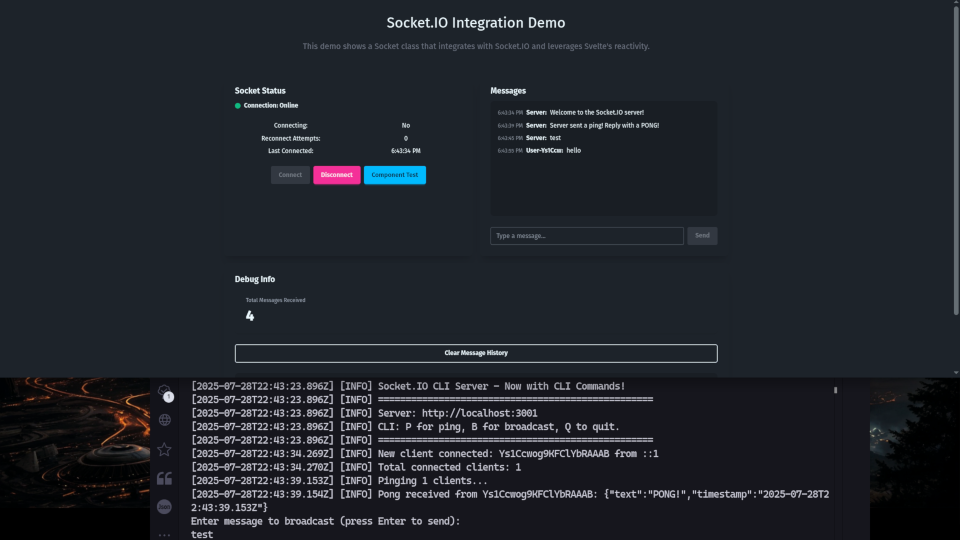

# Socket.IO Integration with Svelte 5 and Runes

A TypeScript-based Socket class that integrates Socket.IO with Svelte's reactivity system for real-time communication, featuring Svelte context for instance sharing across components.



## Quick Start

1. **Install dependencies:**
   ```bash
   npm install
   ```

2. **Start the Socket.IO server:**
   ```bash
   cd server
   npm install
   npm start
   ```

3. **Start the Svelte development server:**
   ```bash
   npm run dev
   ```

4. **Open your browser** to view the real-time Socket.IO demo.

## Features

- **Automatic Reconnection**: Manages connection drops with configurable reconnection attempts and delays.
- **Reactive Status Tracking**: Provides real-time updates on connection state, errors, and reconnection attempts via Svelte runes.
- **Event-Driven Architecture**: Supports custom and one-time event listeners for clean event handling.
- **Error Handling**: Includes comprehensive error detection and reporting for connection issues.
- **Message History**: Logs messages for debugging, with automatic pruning to manage memory.
- **Svelte Context Sharing**: Enables sharing of socket instances across components using Svelte's context API, eliminating redundant connections.
- **Type-Safe API**: Fully typed with TypeScript for robust integration and developer experience.
- **Resource Management**: Ensures proper cleanup of resources on component destruction.

## Test Server CLI Features
The CLI is your trusty sidekick for monitoring server activity and sending commands faster than you can say "byte me!" Here's the lowdown on the stellar commands at your disposal:

| Command | Function | Geeky Description |
|---------|----------|-------------------|
| **P**   | Ping Clients | Sends a ping to all connected clients.  |
| **B**   | Broadcast to Clients | Broadcast a message to all clients. |
| **Q**   | Quit | Time to shut down the warp drive and exit gracefully.  |

## Project Structure

```
├── src/
│   ├── lib/
│   │   ├── Socket.ts            # Main Socket class with Svelte context integration
│   │   ├── SocketContext.svelte # Showing how to pass the connection to components
│   │   └── SocketExample.svelte # Demo component showcasing socket functionality
│   ├── App.svelte               # Main app component
├── server/
│   ├── server.js                # Socket.IO server implementation
│   └── package.json             # Server dependencies
└── README.md                    # This file
```

## Usage Example

```typescript
// In a parent component (e.g., src/routes/+layout.svelte)
import { Socket } from '$lib/Socket.ts';

const socket = new Socket('http://localhost:3001');
// or
const socket = new Socket('http://localhost:3001', socketConfig);

await socket.connect(); // Initializes connection and sets context
```

## In a child component 
```typescript
import { Socket } from '$lib/Socket.ts';
let socketInstance: Socket = Socket.getSocketContext(); // Retrieve during init
socketInstance.on('message', (data) => {
  console.log('Received:', data);
});
socketInstance.send('message', { text: 'Hello World!' });
console.log('Connection status:', socketInstance.getStatus().connected);
```

**Note**: Set the socket in a parent component during initialization (e.g., `<script>` block of `+layout.svelte`). Retrieve using `Socket.getSocketContext` in child components during initialization and assign to a variable for use in event handlers to comply with Svelte's lifecycle requirements.

# Securing Your Server URL in Vite

Protecting sensitive information, such as your server URL, is crucial for maintaining the security of your application. By leveraging Vite's environment variables, you can securely manage and obscure your server URL, ensuring it remains hidden from client-side code.

## Using Environment Variables in Vite

Vite provides a clean way to define environment variables using `import.meta.env`. This allows you to reference your server URL without hardcoding it in your application code.

### Example: Configuring a WebSocket Connection

Below is an example of how to use Vite’s environment variables to define a WebSocket URL in your JavaScript code:

```javascript
// Initialize a WebSocket connection using the Vite environment variable
const socket = new Socket(import.meta.env.VITE_SOCKET_URL);
```

### Setting Up the Vite Configuration

To define the server URL, configure the `define` property in your Vite configuration file (`vite.config.js`). This approach ensures the URL is injected at build time and remains secure.

```javascript
import { defineConfig } from 'vite';
import sveltekit from '@sveltekit/vite-plugin-sveltekit';

// Vite configuration
export default defineConfig({
  plugins: [sveltekit()],
  css: {
    postcss: './postcss.config.js'
  },
  define: {
    'import.meta.env.VITE_SOCKET_URL': JSON.stringify('http://localhost:3000')
  }
});
```

## Best Practices

- **Use `.env` Files**: Instead of hardcoding the URL in `vite.config.js`, store it in a `.env` file (e.g., `VITE_SOCKET_URL=http://localhost:3000`) and load it using `import.meta.env.VITE_SOCKET_URL`. This keeps sensitive data out of version control.
- **Restrict Exposure**: Ensure environment variables prefixed with `VITE_` are only exposed to the client when necessary, as Vite makes them available in the browser.
- **Production URLs**: Update the URL in your `.env.production` file for deployment to point to your live server (e.g., `https://api.yourdomain.com`).

By following these steps, you can securely manage your server URL and maintain a professional, robust development workflow.

## Demo Features

The included demo (`SocketExample.svelte`) demonstrates:
- **Real-Time Status Indicator**: Visualizes connection status with color-coded feedback.
- **Live Chat**: Sends and receives messages in real-time.
- **Reconnection Testing**: Stop/start the server to observe automatic reconnection.
- **Debug Panel**: Displays message history and connection details.
- **Status Tracking**: Monitors connection state, errors, and reconnection attempts.

## Documentation

- **Configuration Options**: Customize connection settings (e.g., `reconnectionAttempts`, `timeout`) and context key (`socketContext`) via the config object.
- **Status Tracking**: Access reactive `status` object for connection state, errors, and timestamps.
- **Events**: Supports custom events (`message`, `user-joined`) and internal events (`connected`, `disconnected`, etc.).
- **API Reference**: Methods include `connect`, `send`, `on`, `off`, `once`, `getStatus`, `isConnected`, `getSocket`, `clearMessages`, `destroy`, and `getSocketContext`.
- **Svelte Integration**: Use `setContext` in parent components and `getSocketContext` in children for shared socket access.
- **Debugging**: Message logging and console outputs for troubleshooting.
- **Best Practices**: Initialize in parent components, retrieve during child initialization, and ensure consistent config usage.

## Technologies Used

- **Svelte 5**: Reactive UI framework with runes for state management.
- **Socket.IO**: Real-time bidirectional communication library.
- **TypeScript**: Ensures type safety and robust development.
- **Vite**: Fast build tool and development server.
- **Node.js**: Server runtime for the Socket.IO backend.

## Contributing

Contributions are welcome via issues and pull requests. This project showcases:
- Clean architecture for real-time applications
- Reactive state management with Svelte runes
- Type-safe Socket.IO integration
- Robust error handling and reconnection logic
- Modern TypeScript and Svelte practices

## License

MIT License - free to use in your projects
